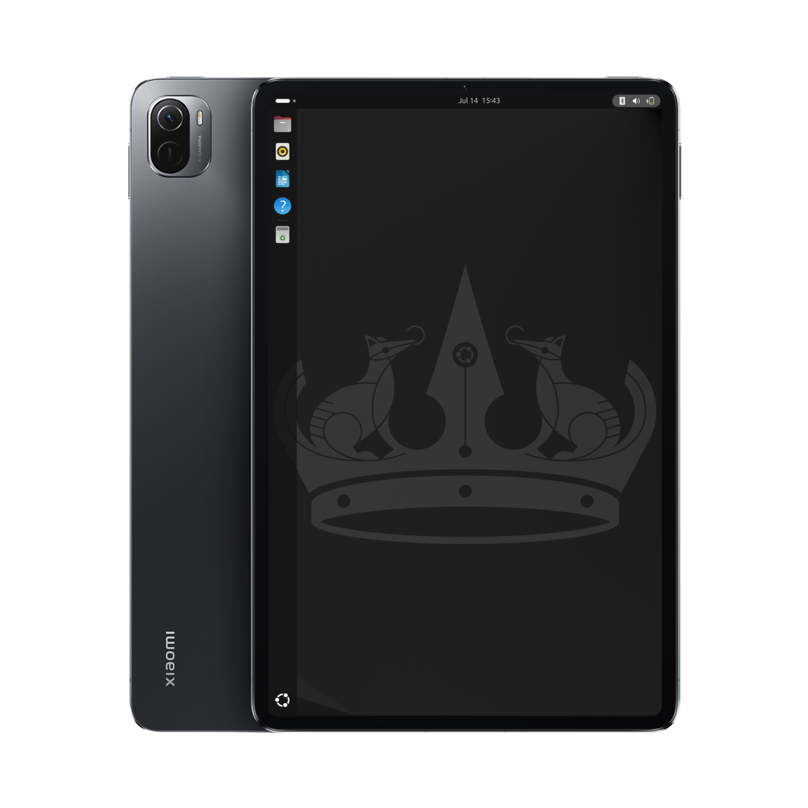

# Running Linux on the Xiaomi Pad 5

## [←](./install-en.md) Dualbooting using switch2linux

### Prerequisites
- Brain

- Rooted android

- Already installed Linux
  
- [mklonimg.cmd (Windows)](https://git.timoxa0.su/timoxa0/mklonimg/raw/branch/main/mklonimg.cmd)

- [mklonimg.sh (Linux/macOS)](https://git.timoxa0.su/timoxa0/mklonimg/raw/branch/main/mklonimg.sh)

- [Python 3](https://www.python.org/downloads/)

- [linux-nabu zip package](https://timoxa0.su/?dir=share/nabu/packages/v3)

### Creating boot image

1. #### Restore your boot image (can be skipped if you used lon-tool with the -Q flag)

2. #### Download mklonimg.cmd for Windows or mklonimg.sh for Linux/macOS

3. #### Install Python (for Windows select Add Python 3.x to PATH)

4. #### Download linux-nabu zip package for your image version 

5. #### Extract vmlinuz-6.1.10-nabu and dtb-6.1.10-nabu from /boot/efi inside zip

6. #### Open cmd (on Windows) or terminal (on Linux/macOS)

7. #### Run mklonimg
##### Windows
```
.\mklonimg.cmd path\to\vmlinuz path\to\dtb
```
##### Linux/macOS
```
bash mklonimg.sh path/to/vmlinuz path/to/dtb
```

8. #### Image will be created in current working directory with name linux.boot.img

9. #### Follow switch2linux install guide -> [link](https://git.timoxa0.su/timoxa0/Switch2Linux-Nabu/src/branch/main/README.md)

### Done!
